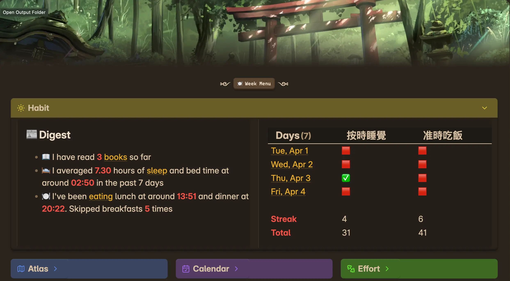

Obsidian vault for a software developer and casual writer, mobile and desktop friendly

[Post](https://axyc.me/notes/Obsidian-tips--and--tricks)

## Setup

In mobile, override the config folder to `.obsidian.mobile`. This setting can be found under `Files And Links`

I also highly recommend the [Lazy Plugin Loader](https://github.com/alangrainger/obsidian-lazy-plugins) to speed up app startup time in mobile

## Hotkeys

- `CMD + N` -> New note

Search
- `CMD + O` | `CMD + SHIFT + F` -> Full text search
- `CMD + SHIFT + O` -> File name & heading search

Quick access
- `CMD + SHIFT + H` -> [[Home]]
	- My default "new" tab on mobile
- `OPTION + D` -> Daily note ([[2024-03-11 - Mon Mar 11|Example]])
	- My default tab to switch to on mobile
- `OPTION + W` -> Weekly note
- `OPTION + M` -> Monthly note

Doodling
- `CMD + SHIFT + E` -> Convert a note to visual zettel (a note with text on front and drawing on back - [[Some Design|Example]]) 
- `OPTION + SHIFT + E` -> Toggle between the two sides for ^

## Folders

I use a modified version of the [ACE](https://medium.com/obsidian-observer/ace-an-exciting-framework-for-pkm-bc3fbbc5665b) folder structure developed by Nick Milo
- Atlas -> anything knowledge related (Space)
- Calendar -> anything time related (Time)
- Efforts -> anything action/project related (Space-Time)

# Changelog

- Bug fixes, plugins prune - 2025-04-27
- Change Summary to "Highlight" - 2025-04-05
- Simplify home page UX & minor bug fix - 2025-04-02

